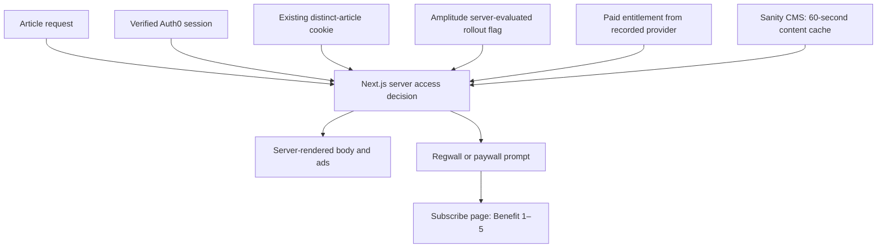
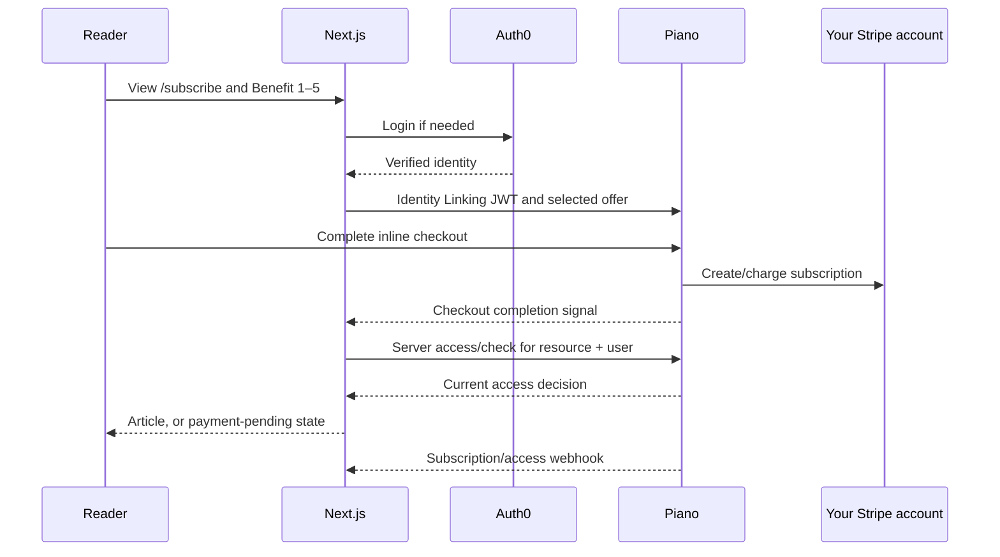
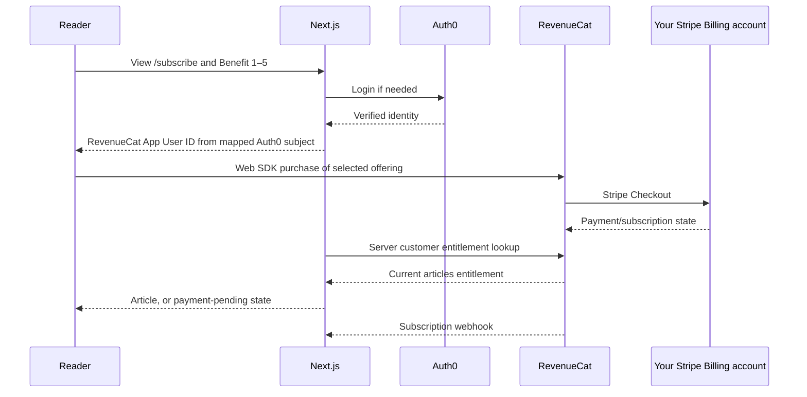

# EQDesk paywall architecture comparison

Research date: 5 September 2026. Status: proposed architecture; no paid integration or benefits route implemented yet. Sources establish product capabilities, not availability in your accounts.

## Shared architecture

Auth0 continues to authenticate readers. Sanity supplies articles and benefits content. Next.js makes the access decision before rendering any protected text. Amplitude selects the rollout experience and measures exposure/conversion. HubSpot receives contact and subscription updates asynchronously; it does not decide article access.



Use a stable internal reader key mapped to verified Auth0 `sub`; include the issuer/tenant when multiple tenants are involved. Auth0 user IDs are unique within a tenant, not globally. Never use a browser-supplied ID as authority for another person's entitlement. [Auth0 identity](https://auth0.com/docs/manage-users/user-accounts/identify-users)

## Option A: Piano

Piano Identity Linking explicitly supports Auth0 JWTs. Auth0 owns login and credentials; Piano maintains a linked subscription user profile. Configure the supported issuer, audience, signature verification, and UID mapping. The encrypted Auth0 SDK session cookie is not itself the JWT expected by Piano: implement a deliberate, verified identity bridge. [Identity Linking](https://docs.piano.io/en/subscriptions/identity-management-identity-linking)



Use Piano's `tp.offer.show` for an inline offer on the benefits page. The `loginRequired` callback starts Auth0 login. Composer is optional for an initial Billing-only integration. [Offer UI](https://docs.piano.io/en/subscriptions/how-to-show-an-offer-using-javascript), [JavaScript setup](https://docs.piano.io/en/subscriptions/installing-piano-javascript)

For article enforcement, Next.js calls `POST /api/v3/publisher/user/access/check` using a private API token and the application, user, and resource IDs. Recheck access after checkout; do not grant access from a success URL or browser callback alone. [Checking access](https://docs.piano.io/en/subscriptions/checking-access)

Your existing Stripe account can be connected. Stripe Billing requires Piano representative enablement, and an application is bound to one Stripe account. Manage Piano-created subscriptions through Piano: direct changes in Stripe can break synchronization. The current guide says automatic Stripe Tax is unsupported. Verify these constraints with Piano before implementation. [Stripe setup](https://docs.piano.io/en/subscriptions/piano-stripe-billing-integration-guide-setup), [Subscription management](https://docs.piano.io/en/subscriptions/piano-stripe-billing-integration-guide-manage-subscriptions)

## Option B: RevenueCat with Stripe Billing

RevenueCat's current Stripe Billing integration supports its Web SDK, Web Purchase Links, and web paywalls. Stripe remains the product/subscription system; subscription management uses Stripe Customer Portal. This is different from RevenueCat Billing, where your Stripe account processes payments but RevenueCat owns the billing lifecycle. For this comparison, prefer **Stripe Billing**. [Stripe Billing setup](https://www.revenuecat.com/docs/web/integrations/stripe), [Payment integration comparison](https://www.revenuecat.com/docs/web/payment-integrations)



RevenueCat accepts an App User ID from your existing authentication system. Require Auth0 login before purchase to avoid anonymous purchase-claiming complexity. The browser uses the public Web SDK key; the server derives the customer ID independently from the authenticated session. [Web SDK](https://www.revenuecat.com/docs/web/web-billing/web-sdk)

Next.js can query `GET /v1/subscribers/{app_user_id}` and evaluate the named `articles` entitlement and its validity. Keep customer access outside Sanity's shared content cache. [Customer API](https://www.revenuecat.com/docs/api-v1/customers)

Cancellation and expiry differ: a cancelled subscription may remain entitled until the paid period ends. Stripe cancellation changes can take up to two hours to appear in RevenueCat. If importing external Stripe purchases, recognize access after invoice payment rather than invoice creation. Plan reconciliation and a pending state. [Stripe Billing compatibility](https://www.revenuecat.com/docs/web/integrations/stripe), [External purchases](https://www.revenuecat.com/docs/web/integrations/stripe/track-external-purchases), [Grace periods](https://www.revenuecat.com/docs/subscription-guidance/how-grace-periods-work)

## Backwards-compatible rollout

Proposed policy, subject to confirming that logged-in non-subscribers also receive only three free articles:

```text
on article request
  read verified identity and existing meter
  resolve any paid subscription using its recorded provider
  if paid access is valid
    render article
  else evaluate access_experience on the server
    legacy_regwall → current policy, unchanged
    piano          → existing three-distinct-article allowance, then pay
    revenuecat     → existing three-distinct-article allowance, then pay
```

- Default the new flag to `legacy_regwall`. Keep the old paths until rollback is no longer needed.
- Evaluate the flag on the server, not just in browser UI. Amplitude supports Node server evaluation; use explicit timeouts and a documented fallback. Send exposure only when the relevant experience is actually shown. [Node SDK](https://www.amplitude.com/docs/sdks/experiment-sdks/experiment-node-js), [Exposure tracking](https://www.amplitude.com/docs/feature-experiment/under-the-hood/event-tracking)
- Keep one meter across variants. Do not run Piano Composer's meter and EQDesk's cookie as competing authorities. Piano supports unique-page metering, but that does not establish migration from our custom cookie. [Composer meters](https://docs.piano.io/en/subscriptions/how-do-i-configure-pageview-meters-in-piano-composer)
- Persist provider ownership independently of flags. A Piano subscriber keeps Piano-backed access and management after a RevenueCat rollout or regwall rollback. Flag changes do not migrate billing records or cancel subscriptions.
- Bind checkout to a server-recorded provider choice through login and payment completion. Amplitude sticky bucketing alone does not guarantee stable assignment across anonymous-to-authenticated identity changes. [Sticky bucketing](https://www.amplitude.com/docs/feature-experiment/advanced-techniques/sticky-bucketing)
- A real integration needs durable identity/provider mapping and idempotent webhook processing. Verify notifications, deduplicate event IDs, then re-fetch authoritative entitlement state. Delayed/retried events must not overwrite a newer state. [Piano webhooks](https://docs.piano.io/en/subscriptions/webhooks), [RevenueCat webhooks](https://www.revenuecat.com/docs/integrations/webhooks)
- On flag failure, preserve the legacy fallback for unassigned readers. On entitlement failure, distinguish unavailable from unpaid: use a bounded known-good access policy or retry state, never silently send an existing subscriber into another checkout. Exact outage policy remains a product decision.
- HubSpot updates follow confirmed subscription events, using a mapped contact ID or custom unique reader property. Newsletter consent remains separate. HubSpot failures do not block reading. [Contacts API](https://developers.hubspot.com/docs/api-reference/latest/crm/objects/contacts/guide)

## Proposed benefits page

```text
/subscribe
  EQDesk header + account controls
  Subscription benefits
    Benefit 1 — Lorem ipsum dolor sit amet, consectetur adipiscing elit.
    Benefit 2 — Lorem ipsum dolor sit amet, consectetur adipiscing elit.
    Benefit 3 — Lorem ipsum dolor sit amet, consectetur adipiscing elit.
    Benefit 4 — Lorem ipsum dolor sit amet, consectetur adipiscing elit.
    Benefit 5 — Lorem ipsum dolor sit amet, consectetur adipiscing elit.
  Selected provider offer / checkout
  Existing subscriber → manage subscription with recorded provider
  Devtools
```

Use the same white/yellow, 900px-wide layout. Benefits may use the mock Sanity adapter; purchasable products and prices come from the selected billing provider. No invented live price or actual charge is part of this research.

## Decisions still needed

1. Architecture comparison only for this step, or also a feature-flagged demo and benefits page?
2. Does the new paywall meter all non-subscribers, including logged-in users, while the legacy variant retains unlimited reading after login?

Before live billing, also settle sandbox availability, product/price/currency, meter lifetime and identity merging, durable storage, and entitlement outage policy. These do not prevent comparing the architectures now.
